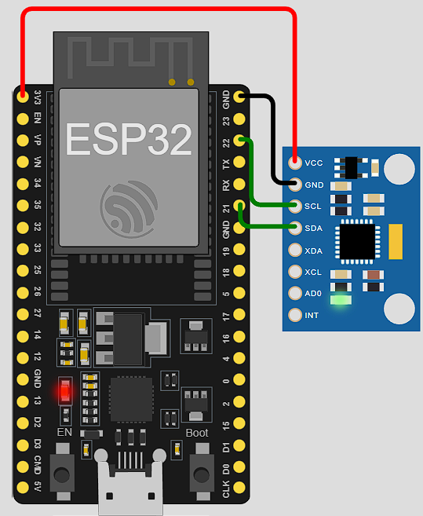

# ESP32-IMU-VISUALIZER  

This project visualizes real-time **accelerometer** and **gyroscope** data from an **MPU6500** sensor using **Arduino** and **Processing**. The sensor data is transmitted over **serial communication** and rendered in a 3D space.

---

##  **Features**
  Reads **Accelerometer (X, Y, Z) & Gyroscope (X, Y, Z)** data  
  Sends data in **JSON format** over Serial  
  Visualizes **real-time 3D rotation** using Processing  
  Uses **Quaternion-based rotation** for smooth  
  The **Kalman filter** blends both **accelerometer** and **gyroscope** to get a more stable and accurate angle estimate  


  

---

##  **Hardware Required**
-  **ESP32** (or any compatible board)  
-  **MPU6050 / MPU6500 Sensor**  
-  **USB Cable** for programming  

---

## **Installation & Setup**
### Connection Diagram



### **Upload Arduino Code**
1. Install **Arduino IDE** & **ESP32**  
2. Connect your ESP32 via USB  
3. Open `IMU_Visual.ino` in Arduino IDE  
4. Select the correct **COM Port**  
5. Click **Upload**   

### **Run Processing Code**
1. Install **Processing 4+** from [processing.org](https://processing.org/)  
2. Install the following Processing Libraries:  
   - **ToxicLibs** (for quaternion calculations)  
   - **Processing Serial** (for COM port communication)  
3. Open `IMU_3D_KALMANFILTER.pde`  
4. Modify the **Serial Port** (default is `COM4`, update if needed)  
5. Click **Run**  

---

##  **Code Overview**
## **Arduino Code (IMU_Visual.ino)**
- Reads MPU6050 **accelerometer & gyroscope** data  
- Formats data into **JSON**  
- Sends data via **Serial**  

## **Processing Code (IMU_3D_KALMANFILTER.pde)**
- Reads JSON data from Serial
- The **Kalman filter** smooths out noisy sensor data by combining:
    1. Gyroscope data (rate of change of angle) → tends to drift.
    2. Accelerometer data (absolute angle measurement) → tends to be noisy  
- Uses **Quaternion math** for 3D rotation  
- Renders a **3D cube** that moves with the sensor  

---

##  **Example JSON Output**
```json
{"ax":0.05,"ay":-0.98,"az":9.81,"gx":0.1,"gy":-0.3,"gz":0.2}
